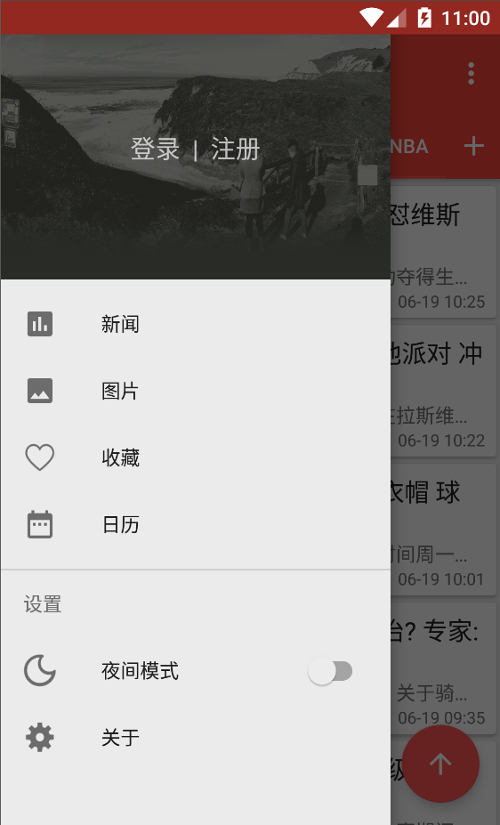
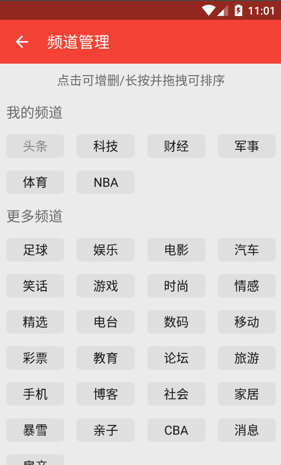
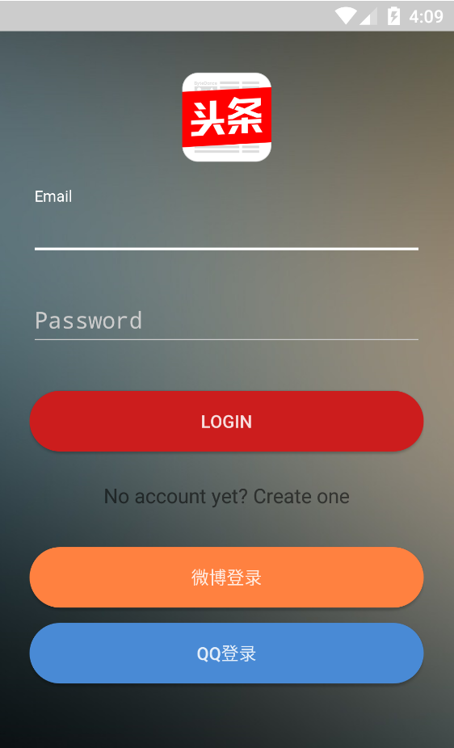

# TopNews

类似今日头条的新闻资讯`app` 采用`MVP+[RxJava]`模式  用户部分采用本地接口

## Preview：

## Points

* 使用RxJava配合Retrofit2做网络请求
* 使用RxUtil对线程操作和网络请求结果处理做了封装
* 使用RxPresenter对订阅的生命周期做管理
* 使用RxBus来方便组件间的通信
* 使用RxJava其他操作符来做延时、轮询、转化、筛选等操作
* 使用okhttp3对网络返回内容做缓存，还有日志、超时重连、头部消息的配置
* 使用Material Design控件和动画
* 使用MVP架构整个项目，对应于model、ui、presenter三个包
* 使用Glide做图片的处理和加载
* 使用Fragmentation简化Fragment的操作和懒加载
* 使用RecyclerView实现下拉刷新、上拉加载、侧滑删除、长按拖曳
* 使用x5WebView做阅览页，比原生WebView体验更佳
* 使用原生的夜间模式、分享、反馈
* 包含收藏等功能

## Api

- 图片api [干货集中营](http://gank.io/api)
- 新闻api [网易新闻](http://c.m.163.com/)
- 用户信息 [topnews-api](https://github.com/GeekGhc/topnews-api)